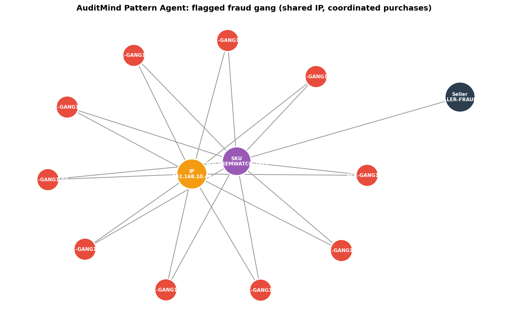
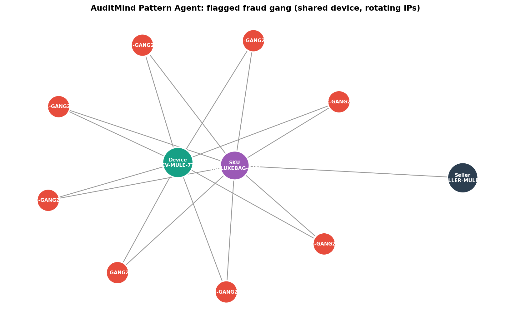
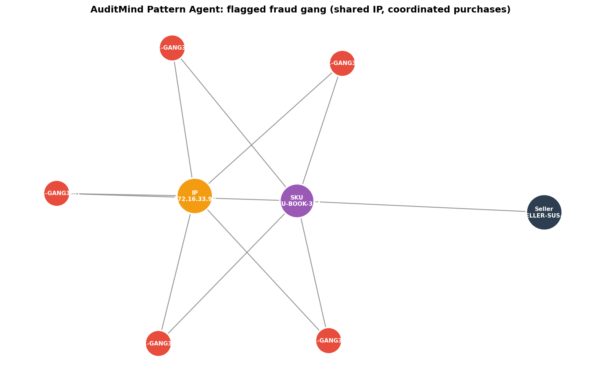

# AuditMind Fraud Detection Report

**Generated:** 2026-04-19 23:40:17
**Transactions analyzed:** 1,523
**Suspicious clusters flagged:** 3
**Risk distribution:** 2 HIGH, 1 MEDIUM, 0 LOW

---

## Cluster 1: HIGH RISK (score 0.863)

**Pattern type:** shared IP, coordinated purchases
**Recommended action:** Route to human auditor for immediate review

### Why this was flagged

- **10 accounts** all used the same IP address `192.168.10.42`
- **10 of 10** accounts were created in the last 14 days
- All **10 accounts** bought the same SKU `SKU-PREMWATCH-7829`
- All purchases happened within **3.42 minutes**
- Revenue concentrated on a single seller: `SELLER-FRAUD-X`
- Total amount: **$5,009.76**

### Risk score breakdown

| Factor | Value | Weight | Contribution |
|---|---|---|---|
| Time burst tightness | 0.658 | 0.40 | 0.263 |
| Shared-hub density | 1.0 | 0.30 | 0.3 |
| Account youth | 1.0 | 0.30 | 0.3 |
| **Total** |  |  | **0.863** |

### Involved accounts

- `ACC-GANG1-03`
- `ACC-GANG1-09`
- `ACC-GANG1-04`
- `ACC-GANG1-05`
- `ACC-GANG1-06`
- `ACC-GANG1-07`
- `ACC-GANG1-00`
- `ACC-GANG1-01`
- `ACC-GANG1-08`
- `ACC-GANG1-02`

### Network graph

---

## Cluster 2: HIGH RISK (score 0.838)

**Pattern type:** shared device, rotating IPs
**Recommended action:** Route to human auditor for immediate review

### Why this was flagged

- **8 accounts** all used the same device `DEV-MULE-777`
- Accounts connected from **8 different IPs** (VPN rotation pattern)
- **8 of 8** accounts were created in the last 14 days
- All **8 accounts** bought the same SKU `SKU-LUXEBAG-4421`
- All purchases happened within **3.8 minutes**
- Revenue concentrated on a single seller: `SELLER-MULE-Y`
- Total amount: **$7,233.85**

### Risk score breakdown

| Factor | Value | Weight | Contribution |
|---|---|---|---|
| Time burst tightness | 0.62 | 0.40 | 0.248 |
| Shared-hub density | 0.8 | 0.30 | 0.24 |
| Account youth | 1.0 | 0.30 | 0.3 |
| **Total** |  |  | **0.838** |

### Involved accounts

- `ACC-GANG2-02`
- `ACC-GANG2-00`
- `ACC-GANG2-07`
- `ACC-GANG2-06`
- `ACC-GANG2-04`
- `ACC-GANG2-03`
- `ACC-GANG2-05`
- `ACC-GANG2-01`

### Network graph

---

## Cluster 3: MEDIUM RISK (score 0.473)

**Pattern type:** shared IP, coordinated purchases
**Recommended action:** Add to daily batch review queue

### Why this was flagged

- **5 accounts** all used the same IP address `172.16.33.99`
- **2 of 5** accounts were created in the last 14 days
- All **5 accounts** bought the same SKU `SKU-BOOK-314`
- All purchases happened within **4.92 minutes**
- Revenue concentrated on a single seller: `SELLER-SUS-Z`
- Total amount: **$261.84**

### Risk score breakdown

| Factor | Value | Weight | Contribution |
|---|---|---|---|
| Time burst tightness | 0.508 | 0.40 | 0.203 |
| Shared-hub density | 0.5 | 0.30 | 0.15 |
| Account youth | 0.4 | 0.30 | 0.12 |
| **Total** |  |  | **0.473** |

### Involved accounts

- `ACC-GANG3-04`
- `ACC-GANG3-01`
- `ACC-GANG3-02`
- `ACC-GANG3-00`
- `ACC-GANG3-03`

### Network graph

---

*Generated by AuditMind Pattern Agent + Risk Agent + Alert Agent*

*Human auditor confirmation required before any account action.*